# Pixémon Éclipse

Un jeu de créatures en pixel art, en un seul fichier HTML : **ouvre `index.html` dans un navigateur** (ordinateur ou mobile).

**Commandes** : flèches/ZQSD pour bouger · Espace/Entrée = A · Échap = B (maintenir pour courir) · M = menu · souris et écran tactile acceptés.

## L'histoire

Aurélys vit au rythme du Cycle : le jour, Solarion veille ; la nuit, les créatures d'ombre s'éveillent… mais les nuits sont étrangement courtes.

- **Acte I** : Bourg-Lueur, la Route 1, Cendreville et le Badge Roc de Brasia, qui confie le Bracelet du Cycle. La Team Éclipse pille alors la Mine de Cendreville pour voler des Éclats d'Aube : il faut y sauver Tito, l'apprenti mineur, face au lieutenant Corvin. Puis la Forêt Murmure et le Mont Braise, où Vex, chef de la Team Éclipse, vole le Cœur d'Aube de Solarion et plonge la région dans une éclipse.
- **Acte II** : la Rive Brumeuse, Port-Miroir et sa championne Maëlle, la Grotte Écho, plongée dans le noir, Volterre, puis le Carnaval des Masques de Carnavelle (la clé du téléphérique volée, Arlequin, Faustine et le Repaire, où l'on entre déguisé), et l'Observatoire. Là, on découvre qui est vraiment Vex, ce que les fondateurs d'Aurélys ont fait à Nocturion, le gardien de la nuit, et pourquoi il faut rétablir l'équilibre plutôt que de vaincre la nuit.
- **Après la fin** : un vrai cycle jour/nuit, Valen et Maëlle réunis sur le ponton, le Tournoi du Cycle de Brasia (quatre combats d'affilée et un Panthéon), des revanches d'arène, les Ruines de l'Aube et leur Sablier du Cycle, les Gardiens du Cycle à gagner (la piste de Solarion, les chaînes de Nocturion), des quêtes écrites et des Défis d'Élite, le journal de Valen, les Éclats d'Aube et le Pixédex à compléter.

## Ce qui fait le jeu

| Système | En bref |
|---|---|
| Éveil du Cycle | Le Bracelet de Brasia se charge à chaque coup donné ou reçu. Une fois par combat, ÉVEIL DU CYCLE éveille la créature : Solaire le jour (Attaque et Vitesse +1, soin), Lunaire la nuit (Attaque et Défense +1, statuts guéris). Vex, Maëlle, Kael et les gardiens s'éveillent aussi. |
| Lien | Chaque créature a un lien (5 cœurs) qui grandit en marchant en tête, en gagnant, en montant de niveau, au feu de camp ou avec des Biscuits d'Aube. Un lien fort lui fait tenir un coup fatal, chasser ses statuts, réussir plus de critiques et remplir plus vite la jauge d'Éveil. Maman enseigne RETOUR, dont la puissance dépend du lien (jusqu'à 102). |
| Objets tenus | Baies (Sève, Prisme), Miettes Dorées, Ruban Ténacité, Griffe Vive, Amulette Savante, Orbe Furie, Grelot Écho et un renforçateur par type. Arbres à baies qui repoussent chaque jour ; la Boutique rachète les objets. |
| Tableau des Missions | Dans les Centres de Soins : trois missions (capture, chasse par type, pêche) récompensées par de l'argent et des objets, remplacées dès qu'on touche la récompense. |
| Quêtes annexes | Une bulle « ! » dorée signale qui a quelque chose pour toi : montrer un Lumignon au Petit Théo, un Crapaflot au Vieux Gus, apporter trois Baies Prisme à Mémé Rosa, l'Ombrelin de Lili, et Maman qui enseigne RETOUR. |
| Guide | Dans le menu : la table des types (attaque / défense) et le rappel des mécaniques. Le compagnon très attaché déniche parfois des objets en chemin, et une mission « Éveil » apprend à utiliser le Bracelet. |
| IA des dresseurs | Les dresseurs envoient la créature la mieux placée face à la tienne ; les boss gardent leur atout pour la fin et rappellent une créature en mauvaise posture. |
| Cycle jour/nuit | Le temps avance à chaque pas. Les créatures, les PNJ, les soins et certains talents changent selon l'heure. Le lit de la maison (puis le Sablier) permet de choisir l'heure. |
| Événements | Averses (combats sous la pluie, créatures d'eau dans les herbes) et essaim du jour, annoncé dans le journal. |
| Affinités de terrain | Ronces → une créature PLANTE dans l'équipe ; rocher fissuré → ROCHE ; brasier → EAU. Elles ouvrent des raccourcis et des secrets. |
| Énigmes | Arène de Brasia : pousser des rochers dans les failles. Arène de Maëlle : deux vannes inversent la marée. Ruines : un casse-tête de rochers plus corsé. |
| Ciel de combat | Pluie, Zénith et Éclipse durent 5 tours et modifient les dégâts. Une attaque LUMIÈRE dissipe une éclipse. |
| Statuts et talents | Brûlure, poison, paralysie, sommeil ; chaque espèce a un talent passif annoncé en combat (Fermeté, Glissade, Sève Vive…). |
| PP et IA | Les capacités s'usent. Les dresseurs visent juste ; les boss posent des statuts, changent le ciel et utilisent des potions. |
| EXP partagée | Les participants gagnent toute l'EXP, le reste de l'équipe la moitié. |
| Compagnon | La créature de tête suit le joueur, réagit quand on lui parle et flaire les objets cachés. |
| Exploration | Pêche (canne de Gus), 12 Éclats d'Aube et l'Ermite Lumen, quête de Lili, 4 pages du journal de Valen, Pixédex récompensé, Repousse, créatures chromatiques. |

## Mise en scène

Cinématiques plein écran (décors peints, caméra, particules, effets de lumière) aux grands moments, et scènes en jeu avec bandes noires, caméra et bulles d'émotion ; portraits animés dans les dialogues ; intro illustrée ; écran de badge ; générique de fin. En combat : vol stationnaire des créatures ailées, élan des attaques, effets propres à chaque type et à chaque capacité de soutien, zoom sur les critiques, barre d'EXP animée, transitions selon la situation. Dans le monde : lumières de nuit, brume, nuages, oiseaux, poissons, pluie. Musique chiptune par lieu (villes, routes, forêt, montagne, arènes, éclipse, ruines, combats, finale).

Le menu contient la carte de la région, le journal des quêtes (sur plusieurs pages) et les options (son, compagnon, vitesse du texte, combats rapides). L'écran titre présente les nouveautés de la version 6.0 et les crédits. Les sauvegardes des versions précédentes sont reprises automatiquement : les créatures reçoivent un lien selon leur niveau, et le Bracelet du Cycle est remis si le Badge Roc est déjà obtenu.

## Version 19.1 : L'Acte II revisité

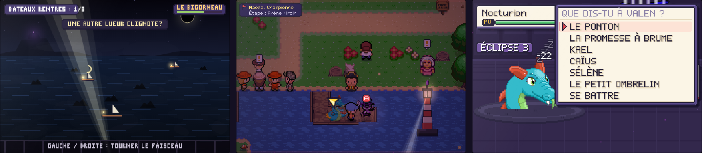

L'Acte II reçoit le même soin que l'Acte I : des situations à vivre plutôt que des combats à enchaîner, et un final qui tient compte de tout ce que le joueur a fait en route.

- **La nuit des bateaux perdus (Port-Miroir)** : le phare de la Pointe s'est éteint avec le soleil et trois bateaux errent dans le noir. Maëlle n'ouvre pas son arène tant que ses marins ne sont pas rentrés. Le Bracelet du Cycle rallume l'Éclat d'Aube du phare (ce que le Prof vient d'expliquer devient une action), puis une **vue « du haut du phare »** : on tourne le faisceau avec la croix pour retrouver chaque bateau dans la brume avant qu'il ne heurte les récifs. Le dernier est encerclé par un **Torrentor rendu fou par l'éclipse** : un combat-épreuve où il faut tenir 4 tours **sans le mettre K.O.** (le calmer vaut une Coquille Calme et un épilogue différent). Ensuite, le phare tourne chaque nuit au-dessus du port, et Maëlle raconte ce qu'il représentait pour Valen et elle.
- **Le petit veilleur du ponton** : un petit Ombrelin aperçu dans la brume de la Route 2 attend chaque nuit au bout du ponton de Valen (désormais accessible). Mémé Rosa raconte Brume ; un Biscuit d'Aube et un peu de patience, et il te suit… jusqu'au dôme.
- **La Centrale en douce** : les sbires montent la garde et tournent la tête, comme dans la Mine. Qui atteint Orso sans s'être fait voir le prend de court (pas de surcharge) et trouve sa « prime de sécurité ».
- **L'Observatoire sous tension** : le sceau de Nocturion cède à vue d'œil (3 %, 2 %, 1 %, 0 %), Kael retient un sbire pour toi, une énigme remplace l'ordre des consoles écrit en clair, et **Sélène peut être convaincue sans combat** si l'on a écouté sa pierre d'écho ou lu sa lettre à la Centrale ; elle entre alors au dôme avec toi.
- **Les mots pour Valen** : quand Nocturion entre en jeu, on peut parler à Valen. Le ponton, la promesse à Brume, Kael (selon ce qu'on lui a dit au feu de camp), Caïus (le mémo de la Centrale, ou l'avertissement de Corvin), Sélène, le petit Ombrelin : chaque souvenir trouvé en route le fait douter. Assez de doute dissipe l'éclipse et apaise Nocturion ; trop peu, et Valen se reprend.
- **Épilogue** : avant le générique, ce que tes choix ont changé (le phare, la forêt, Corvin, Orso, Sélène, Valen), et le petit Ombrelin choisit entre Valen et toi.
- **Corrections** : Kael ne découvre plus « pour la première fois » que Vex est son frère à la Centrale (il le sait depuis le Mont Braise) ; le dossier révèle à la place que Caïus surveille Valen.
- Test : `node tools/play.mjs tools/scn-v191-acte2.js`.

## Version 19 : Un monde qui respire

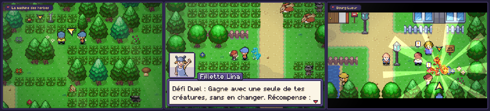

Une refonte du plaisir de jeu : moins de combats, mais des combats qui comptent, une histoire qui prend le temps de raconter, un monde qui réagit.

- **La faune d'Aurélys (fini les combats-surprises)** : plus aucune rencontre invisible dans les herbes ni dans les grottes. Les créatures sauvages vivent à découvert (3 à 7 par lieu selon sa taille, tirées selon leur vraie rareté) et reviennent peu à peu, loin du joueur. Touche-en une pour l'affronter, contourne-la si tu es pressé, surprends-la si elle dort. Une **touffe d'herbes frémissantes** apparaît de temps en temps : une créature plus rare de la zone s'y cache, avec plus de chances d'être chromatique. Les **territoriales** (prédateurs, grosses attaques) te chargent si elles te voient de près ; les créatures **bien plus faibles** que ton équipe s'écartent de ton chemin, et toute la faune t'évite sous Repousse. Option **RENCONTRES : VISIBLES / CLASSIQUES / RARES** (MENU, OPTIONS, OPTIONS DU JEU).
- **Des combats qui comptent** : les dresseurs de route ne t'imposent plus un combat, ils te proposent un **défi** avec une règle et une vraie récompense (Express : gagner en N tours ; Duel : une seule créature ; Sans Objet ; combat sous la pluie, au zénith ou dans l'ombre ; **Combat Inversé**, où les faiblesses deviennent des résistances). On peut refuser et revenir plus tard. Les apprentis des arènes livrent un conseil sur leur Champion. Sbires, rivaux et boss restent incontournables.
- **Boss vivants** : Brasia, Corvin, Kael, Vex, Sélène, Maëlle, Orso, Ambroise, Arlequin, Faustine, Orane, Caïus… lancent une réplique et un retournement quand leur atout entre en jeu, puis quand ils sont au bord de la défaite (sous l'éclipse de Vex, Kael intervient en plein combat).
- **Une difficulté juste** : l'EXP suit l'écart de niveau (battre plus faible rapporte peu, battre plus fort beaucoup), ralentit fortement au-delà du niveau des grands combats à venir et accélère quand on est en retard : plus besoin de farmer, plus de combats joués d'avance. Les dresseurs ordinaires ne sont plus ridiculement faibles face à ton équipe. Niveaux conseillés réalignés sur les vrais Champions (Maëlle abaissée de 2 niveaux).
- **Perdre pour apprendre** : après une défaite, une analyse dit ce qui n'a pas marché (types, vitesse, niveaux, objets, Éveil) avec un conseil sur mesure pour chaque boss. On ne perd plus que 10 % de son argent, et l'on peut **réessayer un boss sur place**, équipe soignée.
- **L'Acte I revisité** : Kael t'apprend à lire la faune sur la Route 1 ; dans la Mine, les sbires montent la garde et tournent la tête (on peut passer dans leur dos) ; **Corvin**, coincé sous l'éboulement, attend ta décision : l'aider ou le laisser… et il s'en souviendra à Volterre (allié qui sabote le générateur d'Orso en plein combat, ou ennemi revanchard). La **Forêt Murmure** est devenue silencieuse : trois machines de la Team Éclipse à trouver (une que ta créature flaire dans les herbes, une gardée par une créature envoûtée qui te rejoint une fois libérée, une surveillée par un sbire), une étiquette à lire avant de couper le bon fil, et une forêt qui se réveille. Le **Mont Braise** gronde pendant l'ascension et Solarion veille au sommet. Après l'éclipse, **une nuit au coin du feu** avec Kael.
- **Les Gardiens du Cycle** : Solarion et Nocturion ne se capturent plus en trois lignes. **Solarion** s'envole quand on l'approche et laisse une Plume d'Aube : on le suit du Mont Braise aux Coteaux, puis à Bourg-Lueur, jusqu'à l'**Épreuve du Zénith** (tenir 6 tours sous son soleil). **Nocturion** recule devant les humains : la nuit, trois fragments de ses chaînes racontent ce que les fondateurs lui ont fait, jusqu'à l'**Épreuve de la Nuit** (le ramener sous le quart de ses PV sans le mettre K.O., sans attaque LUMIÈRE). Les Capsules ne servent à rien : ils te choisissent.
- **Quêtes écrites** : le voleur de croissants (enquête, puis capturer la voleuse ou protéger sa famille), le dresseur d'autrefois (un fantôme du Bois Sépulcral et la sœur qui l'attend), la **course des Coteaux** (mini-jeu chronométré, trois médailles), l'œuf de l'orage (le garder ou le rendre), l'apprenti Tito (du quiz de types au combat d'élève contre maître), trois **Défis d'Élite** (la Duelliste, le Maître Inversé, Séraphine du Crépuscule) et les **pierres d'écho** de la Grotte, qui gardent les voix de Kael, Valen et Sélène.
- **Un monde qui raconte** : les crieurs annoncent les nouvelles de l'histoire au fil de l'aventure ; la bulle « ! » dorée signale qui a besoin de toi.
- Tests : `node tools/play.mjs tools/scn-v19-combats.js`, `scn-v19-histoire.js`, `scn-v19-gardiens.js`, `scn-v19-quetes.js`.

## Version 18.2 : Confort de jeu

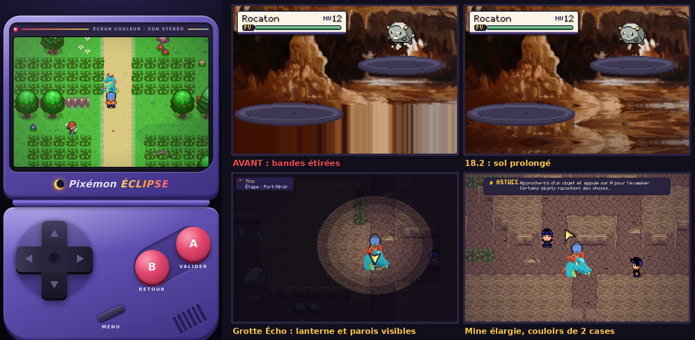

- **Nouvelle console** : le jeu s'affiche dans une vraie console portable. En portrait (téléphone), une console à clapet : écran avec voyant et bandeau « Écran couleur · son stéréo », charnière, croix directionnelle d'une seule pièce (la direction suit le doigt, on glisse de l'une à l'autre sans lever le pouce, la croix s'incline), boutons A et B en diagonale, bouton MENU et grille de haut-parleur. En paysage et sur ordinateur, une console horizontale : croix à gauche, grand écran au centre, A, B et MENU à droite (en paysage sur téléphone, l'écran était minuscule avant). Les touches s'enfoncent et s'allument, même au clavier. Toucher le logo sous l'écran change la couleur de la coque (crépuscule, braise, marée, aube, nuit).
- **Fonds de combat réparés** : les décors illustrés (plaine, forêt, lac, grotte, montagne) sont moins hauts que l'écran, et le bas était rempli en étirant une seule ligne de pixels, d'où les bandes verticales sous les créatures. Le sol est maintenant prolongé en reflétant la bande du bas de chaque décor, légèrement agrandie et assombrie vers l'avant, de jour comme de nuit.
- **Moins de combats à la chaîne** : 8 % de chances par pas dans les hautes herbes (10 % avant), 3 % sur le sol des grottes (4,5 %), 6 % dans les éboulis des grottes. Après chaque combat, 6 à 9 pas de répit, et 3 pas en arrivant sur une carte : plus jamais deux combats coup sur coup. Une équipe qui dépasse nettement les créatures du coin en rencontre deux fois moins. Nouvelle option **RENCONTRES : RARES** (MENU, OPTIONS, OPTIONS DU JEU) pour en avoir encore bien moins.
- **Créatures visibles hors des couloirs** : les créatures sauvages qui se promènent ne se placent et ne marchent plus que dans les endroits dégagés, jamais dans un couloir d'une case ni devant une porte. Elles ne bloquent plus le passage dans les grottes, où il fallait les combattre pour avancer.
- **Grottes élargies et éclairées** : la Mine de Cendreville et la Grotte Écho ont des galeries de deux cases de large (les cases de couloir étroit passent de 35 à 2 dans la mine, de 54 à 5 dans la grotte) et un chemin plus court (la Grotte Écho se traverse en 29 pas au lieu d'une cinquantaine), avec les mêmes dresseurs, objets, rocher fissuré et brasier. Dans les lieux sombres, la lanterne éclaire presque deux fois plus loin et les parois restent devinables hors du halo. Le Bois Sépulcral perd quelques arbres qui fermaient ses passages.
- **Se déplacer** : un arbre ou un toit qui passe devant le joueur devient translucide. Option **COURSE : TOUJOURS** (activée par défaut sur écran tactile, où tenir B en même temps que la croix est pénible) : on court sans rien tenir, B fait marcher. Un conseil explique la course au début.
- **Corrections** : les guillemets « » s'affichaient en points d'interrogation ; l'écran des nouveautés débordait ; à Cendreville, le puits décoratif enfermait l'Éclat d'Aube caché à côté du panneau de la mine, qui ne pouvait plus être ramassé ; les décors ne se posent plus jamais sur un objet caché ; le compagnon n'apparaît plus sur la case d'un personnage en arrivant sur une carte. Les menus trop étroits (commandes de combat, options, cinémathèque, tenues, mot de passe du Théâtre, réglages en ligne, Faille des Songes, Défis de Volterre) ont été élargis : plus aucun texte ne déborde.
- Test : `node tools/play.mjs tools/scn-v182-confort.js` (fonds sans bandes, taux de rencontres et répit, créatures hors des couloirs, options, grottes entièrement accessibles, Éclat de Cendreville).

## Version 18.1 : Ne plus jamais se perdre

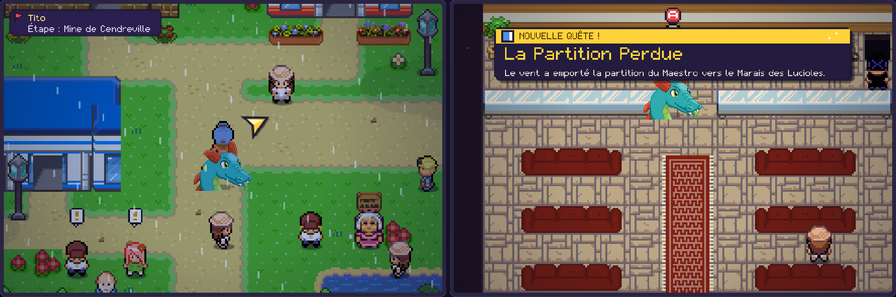

- **Flèche-guide (façon Yo-kai Watch)** : une flèche dorée tourne autour du joueur et montre le chemin de l'objectif de l'histoire, case par case (elle contourne les murs, l'eau et les PNJ), de carte en carte : sorties, portes, arènes, bateaux du passeur, ferry et téléphérique compris. Un repère flotte au-dessus de la personne à voir ou de la porte à prendre, et un bandeau en haut à gauche dit qui aller voir et la prochaine étape (« Étape : Route 2 », « Étape : Passeur Marius (bateau) »). Il donne aussi les conseils utiles : mettre son masque avant la Place du Carnaval, la Tenue des Sables avant la tempête, attendre la nuit pour l'Arène Crépuscule… Toute l'histoire est couverte, du réveil dans la chambre (sac, carte, casquette) jusqu'aux quêtes d'après-histoire. MENU, OPTIONS, FLÈCHE-GUIDE pour la couper.
- **Un vrai système de niveaux** : un plafond suit l'avancée de l'histoire (15 avant le premier badge, 16 après, puis 18, 22, 25… jusqu'à 38 avant l'Observatoire, aucun après la fin). Aucune créature sauvage (herbes, créatures visibles, pêche, essaims, éclipses), aucun dresseur ordinaire et aucun mini-boss ne le dépasse, ni n'a plus de 6 niveaux (8 pour les dresseurs) d'avance sur ta meilleure créature : un lieu visité trop tôt, comme le Bois Sépulcral la nuit, n'envoie plus de créature de niveau 33 contre une équipe de niveau 14. Les Champions et les grands combats de l'histoire gardent leurs niveaux. Une créature sous le niveau conseillé gagne jusqu'à 2,5 fois plus d'EXP (mode normal), ce qui aide aussi un ami qui rejoint l'aventure en retard. À l'entrée de chaque zone, une pastille indique les niveaux qu'on y rencontre (verte, jaune ou rouge selon ton équipe), et la flèche-guide conseille de s'entraîner si l'équipe est trop juste.
- **Annonce des quêtes** : « NOUVELLE QUÊTE ! », « QUÊTE TERMINÉE ! » et « NOUVEL OBJECTIF » s'affichent en grand avec le nom de la quête et ce qu'il faut faire. **À plusieurs**, une quête reçue en parlant à quelqu'un est donnée à tous les joueurs de l'aventure (avec les objets remis au départ), qui voient « Partagée par Alice ».
- Tests : `node tools/play.mjs tools/scn-v181-guide.js` (itinéraire de chaque étape de l'histoire, conseils, bateaux, plafond et rattrapage d'EXP, combats réels, annonces) et, à deux navigateurs, `node tools/net2.mjs tools/scn-v181-aventure.js` (quête partagée).

## Version 18.0 : Le Carnaval des Masques

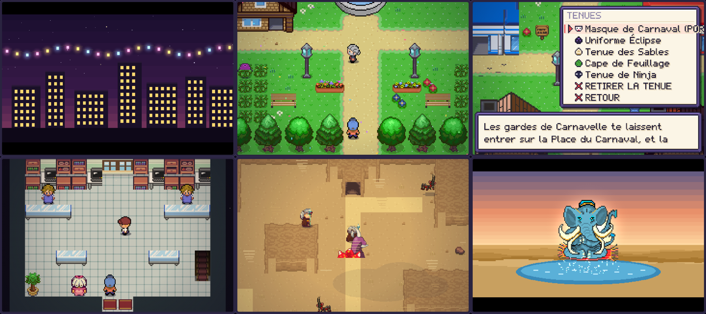

- **Un nouveau chapitre au milieu de l'histoire** : après le Badge Volt, la clé du téléphérique de Volterre est volée par un sbire masqué. Les Gorges du Vent s'ouvrent à l'ouest de Volterre et mènent à **Carnavelle**, en plein Carnaval des Masques. Il faut un masque pour entrer sur la Place du Carnaval, se mêler à la foule pour surprendre les sbires, battre **Arlequin** à l'Arène des Masques (5e badge, le Badge Masque, avec une énigme de reflets), obtenir un uniforme de la Team Éclipse cousu par **Mirella**, donner le mot de passe du Théâtre, le code du robot du Repaire, libérer l'ingénieure Clara et affronter **Faustine**, la couturière de la Team Éclipse. La clé rapportée à Ambroise, l'histoire reprend vers l'Observatoire. Dans une partie déjà terminée, le chapitre se déclenche en arrivant à Volterre (c'est alors la clé de secours qui est volée) et ne bloque rien.
- **Déguisements (MENU, TENUES)** : Masque de Carnaval (accès à la Place), Uniforme Éclipse (les sbires ne t'attaquent plus et te parlent), Tenue des Sables (traverser la tempête de sable), Cape de Feuillage (deux fois moins de rencontres) et Tenue de Ninja (les dresseurs ne te repèrent plus). Le joueur change d'apparence, et ses amis en ligne le voient déguisé.
- **Huit nouveaux lieux et quatorze intérieurs** : Route 3 · Gorges du Vent, Carnavelle et sa Place du Carnaval, Dunes d'Ambre (tempête de sable), Oasis de Sahra, Tombeau du Roi des Sables et sa Crypte (énigme des quatre statues), Marais des Lucioles, Île Corail (ferry depuis Carnavelle) ; Grand Magasin sur deux étages, Atelier Mirella, Théâtre des Lumières, Repaire de la Mascarade, Bureau de Faustine, Arène des Masques, Commissariat, Bazar des Dunes, Maison d'Amina, Cabane de Bérénice, Paillote du Lagon… La carte de la région, l'Envol et les Expéditions de la Boîte les connaissent.
- **De vrais magasins** : le Grand Magasin a cinq rayons (Capsules, Soins, Objets à tenir, Disques, Pierres d'évolution) ; la pâtisserie de Praline, la marchande de fruits, le Bazar des Dunes, la sorcière Bérénice et la Paillote ont chacun leur stock.
- **117 nouvelles créatures** (263 au Pixédex), dont deux légendaires uniques en aventure à plusieurs : **Oasiphant**, gardien de la source (à l'aube ou au crépuscule, après la Crypte) et **Djinnflamme**, le génie de la Lampe Ancienne (chez la Sage Amina, une nuit). Nouvelles familles dans tous les nouveaux lieux, évolutions de nuit, sous la pluie ou par pierre (nouvelle Pierre Sable).
- **25 capacités, 10 Disques Cycle et de nouveaux objets** : Sable Capsule, Festi Capsule, Eau d'Oasis, Granité, Sirop de Menthe, Barbe à Papa, Pomme d'Amour, objets précieux à revendre (Scarabée d'Or, Masque d'Or, Ambre…).
- **Quêtes et défis** : la Partition Perdue du Maestro, les trois élèves de Maître Kaito, la poupée de Bérénice, le Concours de Costumes (une fois par jour), les prédictions de Madame Prophétie, et le **Grand Bal** : chaque nuit sur la Place, une revanche contre Faustine. Revanches d'Arlequin après la fin.
- **Ambiances et mise en scène** : quatre cinématiques (le Carnaval, la fuite de Faustine, le gardien de la source, le génie de la lampe), deux musiques (Carnaval, Désert), sable et tempête dans le désert, vent dans les gorges, confettis et lampions sur la Place, lucioles dans le marais.
- **À plusieurs** : toutes les scènes du chapitre se vivent ensemble (vol de la clé, masque et uniforme offerts à chacun, sbires, reflets et champion combattus à deux avec le badge pour tous, mot de passe, code, Clara, Faustine, retour de la clé). Un ami qui suit une scène profite du déguisement qu'il possède.
- **Commandes du créateur** : TOUS LES DÉGUISEMENTS et TOUS LES BADGES s'ajoutent au menu ; les nouvelles créatures et les nouveaux lieux sont dans DONNER UNE CRÉATURE et TÉLÉPORTATION.
- Six succès, sauvegardes migrées automatiquement. Tests : `node tools/play.mjs tools/scn-v18-donnees.js` (données, combats avec chaque capacité, évolutions, capsules), `tools/scn-v18-monde.js` (dimensions, portes, passages, accessibilité de chaque PNJ et objet, rendu des 23 lieux), `tools/scn-v18-histoire.js` (le chapitre de bout en bout, puis le désert, le Tombeau, les légendaires, le ferry, les quêtes, les boutiques), `tools/scn-v18-ecrans.js` (menus, carte, cinématiques) et, à deux navigateurs, `node tools/net2.mjs tools/scn-v18-aventure.js` (le chapitre entier à deux ; aussi avec `DROP=0.2`).

## Version 17.1 : Un seul monde

- **Les mêmes créatures pour tout le monde** : en aventure à plusieurs, les joueurs qui sont sur la même carte voient les mêmes créatures dans les herbes, aux mêmes endroits, qui bougent de la même façon (et la même averse). Le premier arrivé sur la carte les fait vivre et les envoie aux autres ; s'il s'en va, un autre prend le relais sans que rien ne change à l'écran.
- **Premier arrivé, premier servi** : le premier qui touche une créature l'affronte (ses amis le rejoignent comme d'habitude). Celui qui arrive une fraction de seconde trop tard voit « Trop tard ! Alice a trouvé ce Ratounet avant toi. »
- **Le premier qui capture l'a** : en combat de groupe, si plusieurs joueurs lancent une Capsule au même tour, c'est celui qui l'a lancée le plus vite qui passe en premier. Dès qu'elle réussit, le combat s'arrête : la créature va dans son équipe et son Pixédex à lui seul, et les autres voient « Alice a attrapé Rocaillon en premier ! » (ils gagnent quand même l'EXP).
- **Des légendaires uniques** : un légendaire n'appartient qu'à un seul joueur de l'aventure. Le premier qui le capture (seul ou en groupe) le garde ; il disparaît aussitôt du monde des autres, même de ceux qui n'étaient pas connectés (ils l'apprennent en se reconnectant). Ce qui venait après lui s'ouvre quand même pour tous (Crépuscel après Solarion et Nocturion, la porte du sceau après Masquaserp…), et le succès reste à celui qui l'a capturé.
- Tests : `node tools/play.mjs tools/scn-v17-capture.js` (Capsules du même tour, sauvegarde) et `node tools/net2.mjs tools/scn-v171-monde.js` (mêmes créatures, averse, « trop tard », relais, légendaire capturé hors ligne ; aussi avec `DROP=0.2`).

## Version 17.0 : Aventure à plusieurs

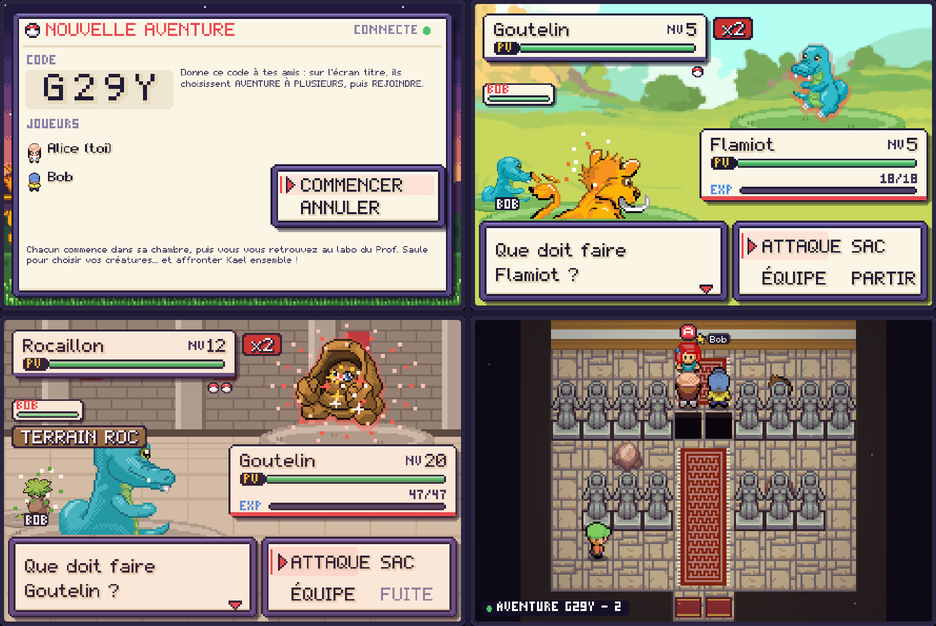

- **Toute l'histoire à plusieurs** : sur l'écran titre, AVENTURE À PLUSIEURS, puis NOUVELLE AVENTURE. Le jeu donne un code de 4 caractères ; les amis choisissent AVENTURE À PLUSIEURS, puis REJOINDRE, et le tapent. Une salle d'attente montre qui est connecté, puis chacun commence dans sa chambre. Jusqu'à 4 joueurs, chacun sur son téléphone ou son ordinateur.
- **Une sauvegarde par aventure** : la partie est enregistrée sur chaque appareil sous le code de l'aventure, à côté des trois parties habituelles. Pour reprendre : CONTINUER L'AVENTURE sur l'écran titre (ou AVENTURE À PLUSIEURS, puis CONTINUER) ; on se reconnecte tout seul et on se retrouve.
- **Le tutoriel ensemble** : au labo, chacun choisit sa créature ; Kael attend que tout le monde ait choisi (« On l'attend ! ») puis affronte tous les joueurs en même temps. Le Prof. Saule remet ensuite Pixédex, Capsules et Potions à chacun.
- **On combat tout ensemble** : créatures sauvages, dresseurs, champions d'arène, Kael, la Team Éclipse, les légendaires… Dès que l'un commence un combat, les autres le rejoignent automatiquement, où qu'ils soient, puis reviennent là où ils étaient. Chacun touche la prime du dresseur et gagne l'EXP. Celui qui attrape un légendaire le garde (depuis la 17.1, il disparaît chez les autres).
- **Des scènes partagées** : quand l'un déclenche une scène de l'histoire (parler à un champion, à un légendaire, à un personnage clé, se faire repérer par un dresseur…), les autres sont transportés près de lui et la vivent sur leur écran ; ses combats se jouent ensemble et chacun reçoit badges, bracelet et récompenses. Les scènes qui se déclenchent en marchant ou en entrant dans un lieu sont partagées avec ceux qui sont sur la même carte ; les autres les vivront en y passant. Un ami occupé (menu, autre combat) rattrape la scène dès qu'il est libre et reprend le résultat du combat.
- **Toujours ensemble** : l'heure d'Aurélys est commune à toute l'aventure. EN LIGNE, JOUEURS, puis ALLER LE VOIR téléporte auprès d'un ami. RÉGLAGES permet de demander avant de rejoindre un combat, ou de ne plus suivre les scènes.
- **Amis pour de bon** : dans un salon ordinaire, AJOUTER EN AMI remplace FAIRE ÉQUIPE. Les amis sont retenus par l'appareil, d'un salon à l'autre, et se rejoignent automatiquement à chaque combat, même sur une autre carte (MES AMIS pour la liste, RETIRER DES AMIS pour arrêter).
- **Ton apparence, pour toi aussi** : le personnage choisi (OPTIONS, APPARENCE, ou le profil en ligne) s'affiche enfin sur ton propre écran (monde, carte de la région, Carte de Dresseur), et plus seulement chez tes amis.
- **Équilibrage revu** : l'adversaire se renforce selon le nombre de joueurs debout (PV x1,9 / x2,7 / x3,5, Attaque +12 % / +22 % / +32 %, Défense et Vitesse un peu) pour que chacun encaisse à peu près autant qu'en solo. Sur des centaines de combats simulés : contre trois créatures de dresseur, environ 45 % de victoires seul et 50 à 60 % à plusieurs, pour 80 à 90 % des PV perdus ; contre une créature sauvage, environ 20 % des PV perdus quel que soit le nombre de joueurs. Bonus d'EXP x1,2 / x1,35 / x1,5 (x1,1 / x1,2 / x1,3 contre les dresseurs).
- **Sous le capot** : le moteur de combat en groupe gère désormais les équipes adverses (créature suivante choisie selon les types, Super Potions, Éveil des dresseurs et des légendaires, terrains Roc, Volt, Marée et Crépuscule). Chaque scène partagée est rejouée par le jeu de chaque joueur ; ses combats portent un identifiant commun, et un ami qui arrive après la bataille en reprend simplement le résultat. Un joueur qui perd la connexion en plein combat revient à son aventure sans rien casser.
- Tests : `node tools/play.mjs tools/scn-v17-moteur.js` (300 combats aléatoires contre des dresseurs à 1-4 joueurs, équilibrage, relecture visuelle) et, avec les relais locaux : `node tools/net2.mjs tools/scn-v17-aventure.js` (de l'écran titre à Brasia : code, Kael à deux, scène de dresseur, combat sauvage rejoint de loin, badge pour les deux, ALLER LE VOIR, reprise), `node tools/net2.mjs tools/scn-v17-histoire.js` (case piégée, entrée de lieu, ami occupé, réglage, légendaire, coupure), `SIDES=A,B,C node tools/net2.mjs tools/scn-v17-amis.js` (amis dans un salon ordinaire) et `SIDES=A,B,C node tools/net2.mjs tools/scn-v17-aventure3.js` (Kael à trois) ; tous aussi avec `DROP=0.2`.

## Version 16.0 : Combats en groupe

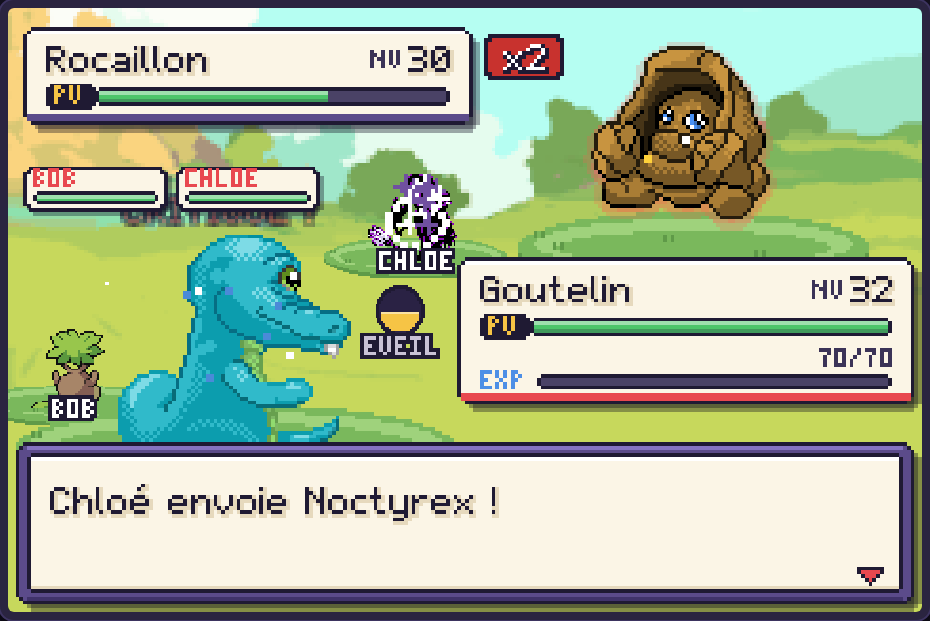

*Depuis la 17.0 : AJOUTER EN AMI remplace FAIRE ÉQUIPE, les amis rejoignent les combats automatiquement depuis n'importe quelle carte, et le renforcement de l'adversaire est plus doux (voir ci-dessus).*

- **Faire équipe** : dans un salon, parle à un ami (ou passe par EN LIGNE, AMIS) et choisis FAIRE ÉQUIPE. Un groupe compte jusqu'à 4 joueurs. Les membres ont une étoile à côté de leur nom, sur la carte et dans les listes ; EN LIGNE, GROUPE montre le groupe et permet de le quitter.
- **Venir aider** : quand un membre du groupe affronte une créature sauvage (hautes herbes, créature visible ou pêche), ceux qui sont sur la même carte reçoivent un appel : « Alice affronte un Rocaillon sauvage ! Aller l'aider ? ». On peut aussi la rejoindre plus tard, en plein combat : un « ! » clignote au-dessus d'elle, on s'approche, A, puis AIDER. On entre dans le combat au début du tour suivant.
- **Une créature plus forte à plusieurs** : à chaque joueur qui arrive, la créature sauvage se renforce (aura rouge et badge x2, x3, x4). Par rapport à un combat seul : PV x2,6 / x4,2 / x5,8, Attaque +15 % / +30 % / +45 %, Défense et Vitesse +10 % / +20 % / +30 %, et elle attaque une fois par joueur à chaque tour, en visant chacun à son tour. Si un joueur part ou n'a plus de créature, elle s'affaiblit d'autant. Sur des centaines de combats simulés, chaque joueur perd en moyenne environ 20 % de ses PV seul, 32 % à deux, 44 % à trois et 52 % à quatre.
- **Avec ses vraies créatures** : PV, PP, statuts, baies mangées et objets utilisés sont conservés après le combat ; on peut changer de créature, utiliser le sac (soins, rappels, capsules) et l'Éveil. L'EXP est gagnée par chacun, avec un bonus de groupe (x1,4 à deux, x1,8 à trois, x2,2 à quatre). Celui qui réussit à capturer la créature la garde ; les autres gagnent quand même l'EXP.
- **Partir, fuir, perdre** : un invité peut PARTIR à tout moment (ses amis continuent sans lui). Celui qui a trouvé la créature peut FUIR, ce qui arrête le combat pour tout le monde. Un joueur dont toutes les créatures sont K.O. regarde la suite ; si le groupe gagne, il rentre se soigner sans rien perdre.
- **Sous le capot** : celui qui a trouvé la créature calcule chaque tour avec les formules du jeu (talents, objets tenus, breloques, ciels, lien, Éveil) et envoie à chacun la même suite d'événements ; chaque écran la rejoue avec ses propres animations, sa créature au premier plan et celles des amis plus petites autour. Les joueurs qui tardent à choisir (45 s) attaquent automatiquement. Les créatures envoyées sur le réseau sont vérifiées à l'arrivée.
- Deux succès et une ligne dans le journal. Tests : `node tools/play.mjs tools/scn-v16-groupe.js` (300 combats aléatoires à 1-4 joueurs avec arrivées et départs, équilibrage, relecture visuelle) et à trois navigateurs (remplacé en 17.0 par `scn-v17-amis.js`, mêmes situations avec les amis : arrivée en plein combat, même fin sur les trois écrans, départ en cours de combat).

## Version 15.0 : En ligne entre amis

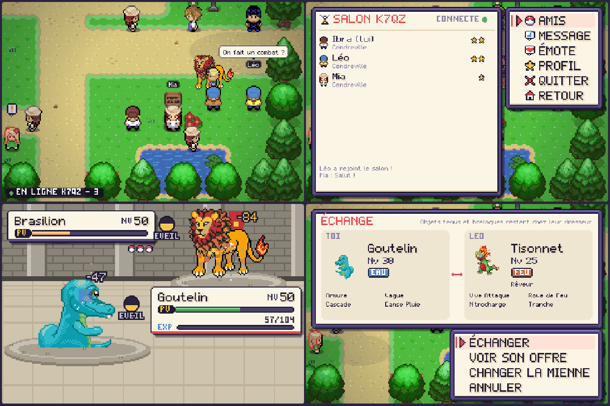

- **Salons à code** : JOUER EN LIGNE sur l'écran titre, ou EN LIGNE dans le menu du jeu (touche MENU). Un joueur crée un salon et reçoit un code de 4 caractères ; ses amis choisissent REJOINDRE et le tapent sur le clavier à l'écran. Jusqu'à 8 joueurs, sur téléphone ou ordinateur, sans compte et sans rien installer. Le dernier salon est retenu pour y revenir en un geste.
- **Pseudo et apparence** : chacun choisit un pseudo (un surnom, jamais son vrai nom) et l'un des 14 personnages.
- **Les amis sur la carte** : au même endroit, on voit ses amis marcher, avec leur nom au-dessus de la tête. Ils ne bloquent pas le passage. A devant un ami ouvre son menu : COMBAT, ÉCHANGE, MESSAGE. Le voyant en bas à gauche indique le salon et le nombre de joueurs.
- **Messages rapides et émotes** : 14 phrases toutes prêtes (« Salut ! », « On fait un combat ? »…) affichées dans une bulle, et 5 émotes. Pas de texte libre : c'est plus sûr pour les plus jeunes.
- **Combats entre amis** : 3 contre 3 ou 6 contre 6, tous au niveau 50 ou aux vrais niveaux. Talents, objets tenus, breloques, tempéraments, lien, Éveil et ciels comptent comme en aventure. Celui qui lance le défi calcule chaque tour avec les formules du jeu, puis les deux écrans rejouent exactement le même combat, chacun de son côté. Les équipes sont des copies : ni EXP, ni argent, ni PV perdus. On peut ABANDONNER ; une déconnexion annule simplement le combat (un ami qui quitte l'appli un instant a une minute pour revenir).
- **Échanges** : chacun propose une créature et voit celle de l'autre (fiche complète). L'échange n'a lieu que lorsque les deux confirmations se sont croisées, et une confirmation envoyée ne peut plus être annulée. Les objets tenus et les breloques restent chez leur dresseur. Une créature reçue gagne plus d'EXP (x1,5).
- **Invitations** : une invitation s'affiche dès que tu es libre (fin d'un dialogue ou d'un combat) ; si tu es déjà occupé, ton ami le sait aussitôt.
- **Sous le capot** : les messages passent en même temps par plusieurs relais publics gratuits (MQTT sur WebSocket sécurisé : EMQX, HiveMQ, Eclipse, shiftr.io, Mosquitto), dont deux sur le port 443, rarement bloqué. Les doublons sont ignorés et les messages importants sont renvoyés jusqu'à l'accusé de réception. Le code du salon n'apparaît jamais en clair sur les relais. Tout ce qui arrive du réseau est vérifié avant d'entrer dans la partie (créatures, positions, noms, tours de combat).
- Quatre succès, une entrée dans le journal avec le bilan des combats et des échanges, sauvegardes migrées automatiquement.
- Tests : `node tools/play.mjs tools/scn-v15-arene.js` (400 combats aléatoires, puis relecture complète des deux points de vue), `node tools/play.mjs tools/scn-v15-menus.js` (écrans), et à deux navigateurs avec des relais locaux (`npm i aedes ws`) : `node tools/net2.mjs tools/scn-v15-duo.js` (salon créé et rejoint par les menus, échange, combat, abandon, déconnexion ; aussi avec `DROP=0.2`, 20 % des messages perdus).

## Version 14.0 : le Grand Voyage

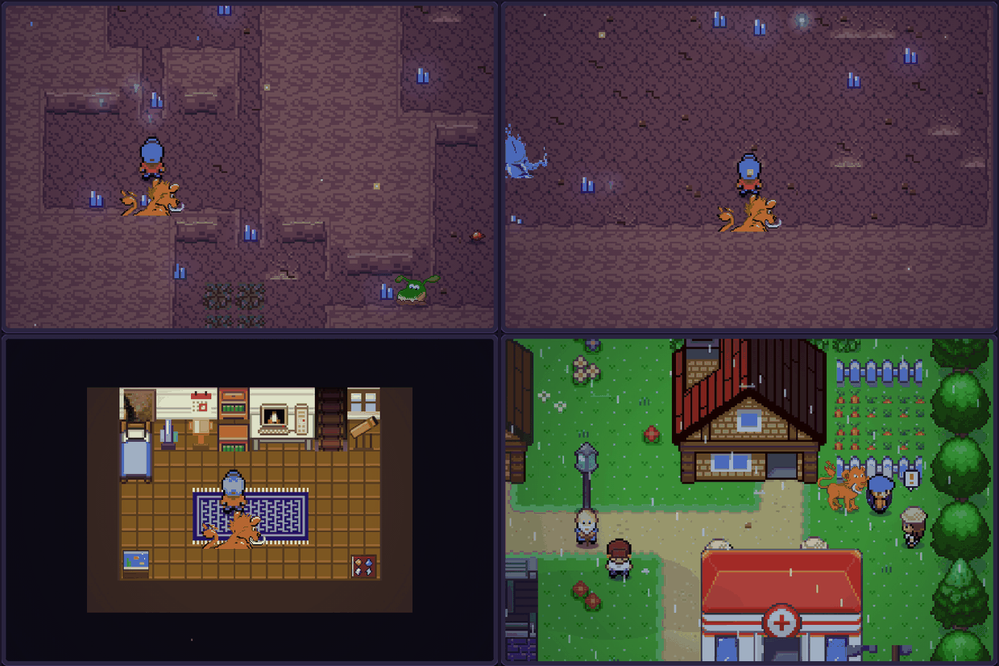

- **L'Envol** : après le Badge Miroir, le Facteur Léo, à Bourg-Lueur, prête son Piafou messager (Sifflet du Relais). Dans la CARTE, A sur un lieu déjà visité t'y emmène : Bourg-Lueur, Cendreville, Port-Miroir, Lunévie, Volterre, les Coteaux, le Lac Opalin, le Récif et le Pic Céleste. Impossible sous terre ou sous un toit.
- **Expéditions** : au Centre de Soins (BOÎTE, puis EXPÉDITIONS), jusqu'à trois créatures de la Boîte partent explorer un lieu visité, pour une expédition courte (240 pas) ou longue (600 pas). Elles reviennent avec des objets propres au lieu, de l'EXP et un lien plus fort. Une créature dont le type convient au lieu (★) et assez forte pour lui trouve plus de choses, et plus souvent des raretés (pierres d'évolution, objets tenus, Disque Cycle).
- **La Faille des Songes** (Lunévie, après le Badge Crépuscule) : un donjon dont les étages changent à chaque plongée (salles, couloirs, herbes, objets, dresseurs-ombres, feux oniriques qui soignent une fois). Les créatures s'accordent à ta force et deviennent plus fortes à chaque étage, et aucun Centre de Soins ne t'attend entre deux étages. Tous les cinq étages, un **Écho** t'attend : Kael, Sélène, Vex, Caïus, puis Valen. Après l'avoir vaincu, tu peux descendre plus bas ou te réveiller. Les **Éclats de Songe** s'échangent auprès de la Rêveuse Nyx (Disques Cycle, Pierre d'Aube, breloques…). Une défaite dans le rêve ne coûte pas d'argent : tu te réveilles simplement à Lunévie.
- **Ta chambre** : le PC de ta chambre propose un catalogue de déco et l'option AMÉNAGER. Six emplacements (table de chevet, coin près du lit, étagère, deux coins de la pièce, mur) acceptent 24 meubles et tableaux. Cinq **trophées** arrivent quand tu les mérites : Coupe du Tournoi, Lampe de Songe (étage 10), Peluche du starter (lien Inséparable), Globe d'Aurélys (tous les points de relais visités) et Vitrine des badges.
- Six nouveaux succès, quatre entrées dans le journal, sauvegardes migrées automatiquement (une partie sauvegardée dans la Faille reprend au même étage).
- Test dédié : `node tools/play.mjs tools/scn-v14-monde.js` (vérifie entre autres que 440 étages générés ont tous une sortie accessible et des objets atteignables).

## Version 13.2 : intérieurs et ambiances

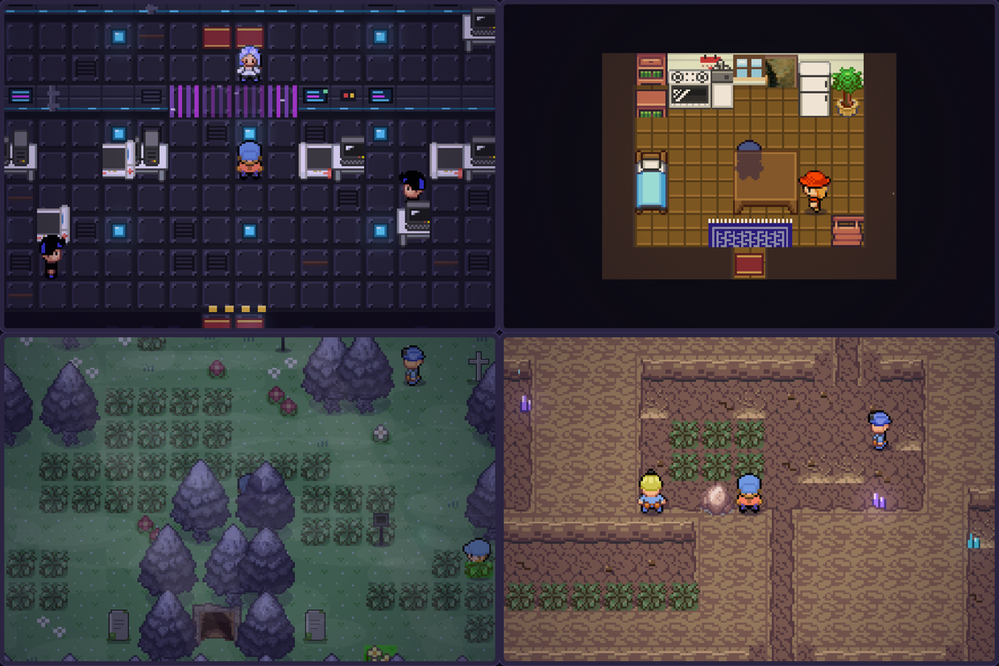

- **Salles techniques refaites** (Observatoire, Dôme, Centrale, arènes Crépuscule et Volt) : dalles de métal rivetées, grilles d'aération, spots lumineux qui pulsent dans le sol, murs à écrans, tuyaux et voyants qui clignotent, bandes de sécurité devant les sorties.
- **Maisons meublées** : lits, commodes, lampes, plantes, caisses, tapis d'entrée, cadres et calendriers chez Jo, Rosette, Ondine, l'Ermite du Récif et Ysolde. Le Dôme a son télescope et ses fenêtres étoilées ; la Citadelle du Cycle devient un sanctuaire de pierre éclairé de torches.
- **Sols vivants** : cailloux et fissures dans les grottes, mousse et gravats dans les ruines, touffes sèches au Mont Braise, gravillons sur les chemins. Des cristaux violets et bleus luisent dans la Grotte Écho, les Galeries Oubliées et la Faille.
- **Bois Sépulcral hanté** : arbres morts aux teintes violacées, pierres tombales, brume qui dérive et feux follets à la place des lucioles.
- Un test vérifie que chaque PNJ et chaque objet à examiner des intérieurs modifiés reste accessible depuis la porte, et que tous les lieux se construisent sans erreur.

## Version 13.1 : des lieux plus vivants

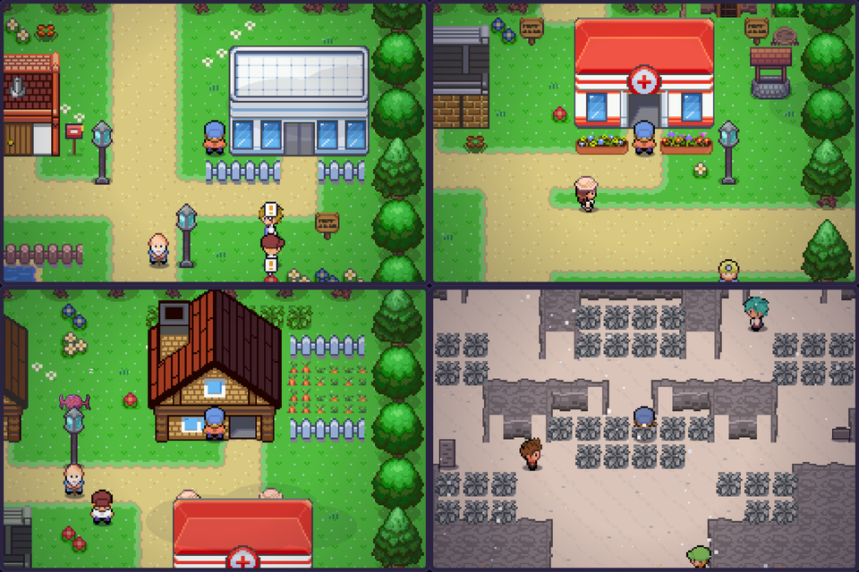

- **Herbe plus franche** et vivante : vert-jaune à la Pokémon, fleurs, petites fleurs blanches et touffes semées dans les prairies (jamais au bord des chemins ni de l'eau).
- **Villes à la Pokémon** : boîte aux lettres devant la maison, clôture blanche devant le labo, potager clôturé à Lunévie, jardinières devant les Centres de Soins, puits à Cendreville, distributeurs et bancs à Volterre, caisses et tonneaux sur les quais de Port-Miroir, enclos de la Pension et potager sur les Coteaux, clôtures le long de la Route 1.
- **Nature** : nénuphars sur les étangs et les lacs, champignons et buissons fleuris en forêt, bancs au bord de l'eau.
- **Pic Céleste enneigé** : sol de neige scintillant, falaises givrées, herbes hautes gelées et chute de neige.
- Toutes les nouveautés graphiques viennent des tilesets libres de Tuxemon (voir `CREDITS.md`). Un test vérifie qu'aucun décor ne bloque l'accès à une porte, un PNJ, un panneau, un objet caché ou une sortie.

## Version 13.0 : le Grand Écran

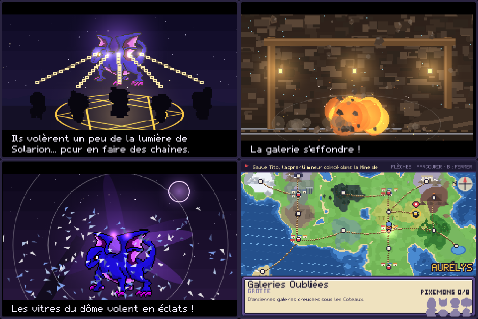

- **Six cinématiques plein écran**, avec décors peints, caméra (travellings, zooms), secousses, particules et effets de lumière, aux grands moments de l'histoire :
  - **La légende du Cycle** (nouvelle partie) : Solarion se lève avec le soleil, Nocturion naît de la lune, leur danse dans le ciel, puis les fondateurs enchaînent Nocturion avec la lumière volée ; il riposte d'un rayon d'ombre qui se brise sur le sceau.
  - **L'effondrement de la mine** : Corvin pose une charge, l'explosion souffle la galerie, la poutre cède, les lanternes tombent, les rochers et la poussière bouchent le passage.
  - **Le vol du Cœur d'Aube** : Solarion jaillit du cratère, gros plan sur Vex, le rayon de lumière aspiré dans son bracelet, puis l'éclipse qui recouvre Aurélys.
  - **Volterre se rallume** : les turbines s'arrêtent, repartent à l'envers dans les arcs électriques, l'onde file le long du câble et la ville s'allume fenêtre par fenêtre.
  - **Nocturion libéré** : le vortex d'ombre, le cri, et les vitres du dôme qui volent en éclats.
  - **Le retour du Cycle** : Solarion revient, les deux gardiens s'inclinent, tournent l'un autour de l'autre, et l'éclipse se dissipe sur l'aube.
- **Passer** une cinématique : B deux fois. A accélère les sous-titres. Le menu **CINÉMAS** (Cinémathèque) permet de revoir celles déjà vues ; les sauvegardes existantes débloquent celles des étapes déjà franchies.
- **Atlas d'Aurélys** : la carte du menu est redessinée (côtes, mer animée, forêts, montagnes enneigées, volcan, lacs, villages et villes, chemins, rose des vents). Les lieux inconnus sont sous le brouillard. Les flèches déplacent un curseur de lieu en lieu ; la fiche affiche le type du lieu, une description, le badge de l'arène et les Pixémons qu'on y trouve (capturés / total).
- **Éveil en gros plan** : en combat, l'Éveil du Cycle déclenche un plan de coupe plein écran (bandeau solaire ou lunaire, lignes de vitesse, créature en gros plan).

## Version 12.0 : les Héritiers du Cycle

- **Pension des Coteaux** : Mamie Odette garde deux créatures, qui gagnent de l'EXP à chaque pas (les nouvelles capacités sont apprises au retrait, payé selon les niveaux gagnés). Papi Firmin prévient quand un **œuf** apparaît près de la clôture.
- **Compatibilité** : même famille, très bonne ; même type, correcte ; les **Vivipère** s'entendent avec tout le monde (le petit est alors de l'espèce de l'autre parent). Les légendaires ne pondent pas.
- **Couveuse** (3 œufs) : les œufs éclosent en marchant, deux fois plus vite avec une créature au talent Corps Ardent ou Torche. Progression visible sur la carte de dresseur du menu, éclosion mise en scène.
- **Hérédité** : le petit naît au niveau 1 avec un lien déjà tissé, hérite du tempérament d'un parent (à coup sûr avec le nouveau **Ruban d'Héritage**), de jusqu'à deux capacités de ses parents que sa famille peut apprendre, et a plus de chances d'être chromatique (encore plus si un parent l'est).
- **L'œuf d'Elias** : une fois le Cycle rétabli, Papi Firmin remet un œuf que ton père lui avait confié, avec une dernière lettre.
- **Échanges** : cinq habitants (Cendreville, Port-Miroir, Coteaux, Lunévie, Volterre) proposent un échange, dont les deux starters que tu n'as pas choisis. Une créature échangée gagne 50 % d'EXP en plus ; son origine s'affiche sur la page PROFIL.
- **Mode Expert** (Options > Difficulté, réversible) : dresseurs environ 8 % plus forts, baies pour les boss, niveau maximum selon les badges (15, 30, 34, 46, puis libre), primes +25 %.
- **Salle de jeux de Volterre** : le Mémo du Cycle (huit paires de Pixémons, dix erreurs au plus), une partie offerte par jour, des jetons à échanger contre des lots (Ruban d'Héritage, Pierre d'Aube, Étoile du Berger…).
- Six nouveaux succès, trois entrées dans le journal, migration automatique des sauvegardes.
- Test dédié : `node tools/play.mjs tools/scn-v12-heritiers.js`.

## Version 11.0 : l'Atelier du Cycle

- **Breloques** : un second emplacement d'équipement, distinct de l'objet tenu (l'objet tenu reste une tactique de combat, la breloque façonne le profil de la créature). 31 breloques en 4 raretés : Communes (une stat), Rares (stat + effet : premier coup amorti, soin sous la pluie, EXP, pièces, lien…), Épiques (gros bonus contre un malus, ou effet fort) et Uniques.
- **Résonance** : une breloque qui partage le type ou la lignée de son porteur voit ses bonus augmenter de moitié. Une breloque reste excellente sur la bonne créature sans jamais être obligatoire.
- **Breloques uniques** : chaque starter, Vivipère, les légendaires et Errenard ont la leur, et certaines modifient un mécanisme existant (Brasier/Torrent/Engrais dès la moitié des PV, bonus sur les attaques d'un autre type…). Anselme les forge quand on les mérite (lien, lignée, exploit).
- **Étincelles de Forge** : laissées par les combats (dresseurs, Champions, Conseil). L'orfèvre Anselme, à Cendreville, améliore les breloques jusqu'au +3, palier par palier (Badge Miroir, Badge Volt, Cycle rétabli).
- **Tempéraments** : chaque créature a désormais une personnalité (+10 % / -10 %), annoncée à la capture et visible sur la nouvelle page PROFIL du résumé.
- **Mélisse**, herboriste de Port-Miroir : fait revenir les capacités oubliées et change le tempérament d'une créature.
- Huit breloques cachées dans le monde, butin de combat, cinq nouveaux succès, une quête dans le journal, et des dresseurs eux aussi équipés après l'histoire.
- Test dédié : `node tools/play.mjs tools/scn-v11-atelier.js`.

## Version 10.0 : Édition Ultime

La plus grosse mise à jour du jeu : le bestiaire double, la carte s'agrandit de six lieux, et l'après-histoire devient une aventure à part entière.

- **146 Pixémons (+76)** : 30 nouvelles familles, toutes avec habitat, horaire, talent et description. Évolutions par **lieu** (Vivipère prend la forme du volcan, du bois, de la ville, des galeries ou du lac où il atteint le niveau 20 ; Cavalsable devient sage au Temple, forteresse ailleurs), par **météo** (Axoluce sous la pluie), pendant l'**éclipse** (Tisonard → Pyronox, Serpillou → Pythombre), sous les **étoiles filantes** (Angeflocon → Séraphivre, Runocon → Runestique), en tenant un **objet** (Spectronce + Encens Noir), en connaissant une **capacité** (Toxiris + Lame-Feuille), par le **lien** ou par **pierre** (nouvelles Pierre Soleil et Pierre d'Aube). La lignée Flocelin résume le Cycle : ange le jour, démon la nuit, séraphin sous les étoiles, givre noir pendant l'éclipse.
- **Six nouveaux lieux** : le **Lac Opalin** (îlot, pontons, cabane d'Ondine), le **Bois Sépulcral** (ouvert seulement la nuit, énigme des quatre lanternes, crypte et son gardien), les **Galeries Oubliées** (rocher à briser, faille à combler, carnets de la Team Éclipse, mineur perdu), le **Récif des Marées** (en bateau depuis Port-Miroir), le **Temple des Fondateurs** (un cadran des phases déplace les murs) et le **Pic Céleste** (téléphérique de Volterre, quatre feux à allumer chacun à son heure).
- **L'origine du Cycle** : huit **Stèles des Fondateurs**, dispersées dans toute la région, racontent Aurorelle la première aube, la naissance de Solarion et Nocturion, l'ombre née de leur querelle, et la famille de Valen, gardienne du sceau. Les huit paroles ouvrent le Temple.
- **Quatre nouvelles légendes** : **Masquaserp** (trois énigmes avant le combat), **Éclipsar** (seulement pendant l'éclipse, et seulement si on lui offre les deux larmes de l'Amulette du Cycle), **Aurorelle** (à l'aube, quand les quatre feux brûlent) et **Errenard**, la créature errante qui change de lieu chaque jour et fuit au bout de deux tours (les crieurs des villes donnent la rumeur du jour).
- **Le Conseil du Cycle** : dans la Citadelle au sommet du Pic, quatre maîtres des phases puis le Maître, sans soins entre les combats. Sélène garde le Crépuscule, Vex garde la Nuit, Valen attend au bout. Le Conseil se renforce à chaque victoire.
- **Défis de Volterre** (arbitrés par Orso, l'ancien commandant de la Centrale) : Défi Mono-type (huit types, huit récompenses) et Défi Égalité (tout le monde au niveau 50), cinq combats sans soins.
- **Combat** : 40 capacités (Abri, Vampigraine, Racines, Double Coup, Façade, Dévorêve, Lame du Cycle qui change de type selon l'heure, Marée Noire plus forte la nuit, Rayon Aurore plus fort à l'aube…), 21 talents (Intimidation, Absorbe-Eau, Paratonnerre, Torche, Technicien, Turbo, Médecin, Heure Dorée, Cycle Vivant…), deux nouveaux ciels (**Orage** et **Ciel Étoilé**), six objets tenus, quatre capsules spécialisées, et 24 **Disques Cycle** réutilisables (disquaire de Volterre et trésors cachés). L'IA pose des graines, se protège quand elle est empoisonnée et évite les coups inutiles.
- **Carnet** (menu) : **42 succès** récompensés, **7 réputations** (cinq villes, les Chercheurs et les Pêcheurs : réductions en boutique et cadeaux), collections (stèles, larmes, fossiles, disques, feux, légendes), chroniques (tout le lore déchiffré), album photo et statistiques.
- **Album photo** : Lise prête son appareil ; 14 clichés à réussir (un FEU sur le Mont Braise, une OMBRE pendant l'éclipse, un fossile au grand air…).
- **Pêche** : mini-jeu de ferrage (arrêter le curseur dans la zone verte, plus étroite pour les poissons rares), **Méga Canne**, carnet de prises, registre d'Ondine.
- **Quêtes** : Élise la jeune fille pâle et le médaillon de sa sœur Ysolde, Gaston le mineur perdu, les perles du Récif, le colis d'un ancien sbire pour Lou, le registre d'Ondine, le Fossile Feuille, le Vivipère du Professeur… Toutes suivies dans le journal.
- **Un monde qui vit** : habitants qui changent de place selon l'heure (la boulangère rentre chez elle le soir, le pêcheur suit la marée), anciens sbires qui cherchent leur place, crieurs qui annoncent rumeurs et essaims, compagnon qui réagit au lieu, à la météo et à l'heure, talents d'exploration (Flair, Pas Feutré, Charmeur).
- **Accessibilité** : option « animations réduites » (moins de secousses et de flashs). Les anciennes sauvegardes sont migrées automatiquement.

## Version 9.0 : Volterre, l'éclipse vivante et le défi d'Elias

- **4e arène dans l'histoire principale** : entre la Grotte Écho et l'Observatoire, la ville de **Volterre**, plongée dans le noir.
  - La Team Éclipse occupe la **Centrale** et détourne le courant vers la barrière du dôme.
  - Base sur deux niveaux : carte d'accès, code à 3 chiffres caché dans les documents, mémos de Vex, Caïus et Sélène, objets cachés, sbires aux stratégies différentes.
  - Boss : le Commandant Orso. Puis Kael découvre le dossier qui révèle que Vex est Valen, son frère.
  - **Arène Volt** : leviers qui inversent les barrières électriques. Le Champion Ambroise (paralysie puis vitesse) a construit le dôme avec Elias.
  - Récompenses : Badge Volt, Aimant, Bracelet du Cycle amélioré (jauge d'Éveil plus rapide). Le téléphérique mène ensuite à l'Observatoire.
  - Niveaux de l'Observatoire et du combat final remontés pour suivre ce 4e badge.
- **L'éclipse transforme le monde** :
  - 6 Larmes de Nocturion visibles seulement pendant l'éclipse, et la statue de Solarion qui pleure une larme de lumière.
  - La mer se retire sous le ponton de Port-Miroir et découvre une épave.
  - Rencontres d'ombre sur la Route 1, dans la Forêt et sur la Rive Brumeuse.
  - Particules et musique propres à l'éclipse.
  - Après Crépuscel, le Sablier peut rappeler une éclipse d'une journée. L'autel du Sanctuaire unit les larmes en **Amulette du Cycle**.
- **Pixédex** : fiche détaillée de chaque créature vue (statistiques, talent, chaîne d'évolution avec conditions, attaques, statut). Défilement rapide.
- **Monde vivant** :
  - Marchande itinérante (une ville par jour, stock tournant, cadeau de fidélité).
  - Facteur de Bourg-Lueur et lettres liées à la progression.
  - Carnet de voyage, orages à Volterre (Orageon sauvage), borne de recharge pour les créatures ÉLEC.
- **Liens** :
  - La Photographe Lise de Port-Miroir photographie tes créatures les plus proches, avec des récompenses et le Coeur du Cycle (liens plus rapides).
  - Message de confiance en combat important.
- **Combat** : indicateur d'efficacité directement dans la liste des attaques.
- **Terrains d'arène** : chaque Champion impose un terrain, affiché pendant le combat (revanches comprises).
  - Brasia : Terrain Roc, attaques ROCHE x1,2.
  - Maëlle : Marée, pluie permanente.
  - Orane : Crépuscule, le ciel bascule entre soleil et éclipse à chaque tour.
  - Ambroise : Terrain Volt, les attaques ÉLEC ne ratent jamais.
- **Défi ultime** : avec 60 espèces capturées et Crépuscel, Papa t'attend sous le dôme, la nuit. Équipe niveau 72 à 76. Récompense : l'Étoile d'Elias sur la Carte de Dresseur.
- **Audio** : thème de la Team Éclipse, musique des villes la nuit, thème du Sanctuaire. La musique suit le passage du jour à la nuit.

## Version 8.0 : la Faille et les nuits d'étoiles

- **La Faille** (après l'aventure) :
  - L'Admin Caïus refuse la paix et creuse sous le Sanctuaire.
  - Un donjon avec deux leviers à baisser (derrière un rocher fissuré et un brasier), un rocher à pousser dans un trou, et cinq dresseurs de la Team Éclipse aux stratégies différentes (sbire, foreurs, éclaireuse, sbire d'élite).
  - Boss : Caïus avec 5 créatures équipées d'objets tenus.
  - Récompense : la Capsule Cycle, une capture garantie.
- **7 nouveaux Pixémons** (70 au total) :
  - La lignée stellaire Nébulin → Galaxelle → Novarium.
  - Grumeroc et Conglolem, propres à la Faille.
  - Les jumeaux mythiques Héliote (le jour) et Séléniote (la nuit) au Sanctuaire.
- **Nuits d'étoiles filantes** (une nuit sur trois) :
  - Étoiles filantes dans le ciel.
  - Météosaur quatre fois plus fréquents.
  - Nébulin à pêcher avec la Super Canne.
  - Poussières d'étoile à ramasser, à échanger chez l'Astronome Lys contre des pierres et des objets rares.
- **Progression** :
  - L'objectif du journal guide aussi après la fin de l'histoire, étape par étape.
  - Revanche quotidienne contre Orane.
  - Récompenses du Pixédex jusqu'à 60 espèces, et une Capsule Cycle pour le Pixédex complet.
  - Rareté affichée dans le Pixédex.
- **Confort** :
  - 3 emplacements de sauvegarde, chacun avec sa copie de secours.
  - Volumes séparés pour la musique et les effets.
  - Correction : la pluie tombe maintenant aussi sur les Coteaux et à Lunévie, ce qui fait apparaître Nuageon.

## Version 7.0 : le Nord et le Crépuscule

- **Nouvelle région** :
  - Les Coteaux d'Aurore, au nord de Cendreville : vignes, cratères de météores, l'autel des fondateurs.
  - Lunévie, un village qui dort le jour et vit la nuit.
  - Le Sanctuaire du Cycle, ouvert après la fin.
- **22 nouveaux Pixémons** (63 au total), avec un vrai moteur d'évolution :
  - Évolutions selon le niveau, l'heure (jour ou nuit), le lien, l'éclipse ou une pierre (Pierre Lunaire, Pierre Orage).
  - Familles à 3 stades et évolutions à embranchement.
  - Un fossile à faire ranimer par le Prof. Saule.
  - Deux nouveaux légendaires : Crépuscel et Présagelle.
- **Histoire** :
  - L'Admin Caïus défie Sélène et Vex se montre à l'autel.
  - Sélène confie le Médaillon de Brume.
  - Chez Grand-mère Ysolde, on apprend que Valen est le grand frère de Kael. Kael livre un combat de rival, puis le médaillon revient à Valen.
- **Arène Crépuscule** : la Championne Orane ne combat que la nuit, dans une salle plongée dans le noir.
- **Après l'aventure** : le Défi du Crépuscule, 7 combats d'affilée avec paliers de récompenses et record.
- **Super Canne** : pêche en eaux profondes (Lunévie, Port-Miroir, Rive Brumeuse).
- **Boutique** : elle vend les pierres d'évolution après le 3e badge.
- **Pixédex encyclopédique** : taille, poids, activité (diurne ou nocturne), évolutions détaillées, habitat (pluie, éclipse, Super Canne).
- **Sauvegarde** :
  - Sauvegarde automatique toutes les 90 secondes en exploration.
  - Copie de secours en cas de fichier corrompu.
  - Migration des anciennes parties.

## Version 6.0 : une aventure complète

- **Introduction jouable** : un rêve étrange, puis le réveil le matin de tes 12 ans. Lou, ta petite sœur, a caché ta casquette ; il faut préparer ton sac, ta Carte de Dresseur, parler à Maman. Les objets de la maison (photos, carnet, télescope, manteau…) racontent l'histoire d'Elias, ton père astronome disparu, avec des gros plans illustrés.
- **41 Pixémons** (16 nouveaux) avec habitats, horaires et météo : certains ne sortent que la nuit, d'autres seulement sous l'orage ou sur certaines rives.
- **Écosystème vivant** : des Pixémons sauvages visibles qui dorment, mangent, jouent, observent le joueur, fuient ou chassent d'autres espèces. Les surprendre endormis facilite la capture.
- **Carnet d'observation** (Assistante Lucie), **quêtes** (Lou, Mémé Rosa, Lucie), **clairière secrète**, objets cachés plus visibles avec la Boussole d'Elias, télévision et dialogues qui changent avec l'histoire, et un fil narratif sur le père qui se conclut après la fin.

## Graphismes

Depuis la version 5.0, tout le jeu est dessiné avec de vrais graphismes en pixel art **libres**, issus du projet
[Tuxemon](https://github.com/Tuxemon/Tuxemon) : les 25 Pixémons (face, dos et icônes animées), les 32 personnages
(sprites de marche, de combat et portraits), les tuiles des cartes (herbe, chemins, rives, falaises, grottes, lave, intérieurs),
les bâtiments (maisons, labo, Centres de Soins, Boutiques, Arènes) et les fonds de combat (avec leur version de nuit).
Les cartes sont auto-tuilées par quarts de tuile (bords de chemins, rives, falaises). Licences et auteurs : voir [CREDITS.md](CREDITS.md).


## Développement

```
src/shell.html      page, style et pad tactile
src/game.js         code du jeu (données, cartes, histoire, combat, rendu)
src/world.js        rendu des cartes (tuiles, auto-tuilage, décors, animations)
src/sprites.json    créatures : face et dos 64x64, icônes 24x24 (PNG base64)
src/art.json        atlas des tuiles et décors, personnages, fonds de combat
tools/tuxatlas.py   régénère art.json et sprites.json depuis Tuxemon → python3 tools/tuxatlas.py [dossier Tuxemon]
tools/build.mjs     assemble index.html             → node tools/build.mjs
tools/sim.mjs       simule les combats de boss      → node tools/sim.mjs   (V3=1 : sans Éveil ni lien, BOND=0..5)
tools/play.mjs      parcours automatique (Playwright) → node tools/play.mjs tools/scn-story.js
tools/scn-v4.js     teste les mécaniques 4.0         → node tools/play.mjs tools/scn-v4.js
tools/scn-intro.js  teste l'introduction jouable     → node tools/play.mjs tools/scn-intro.js
tools/fontcheck.mjs vérifie que chaque caractère existe dans la police bitmap
tools/net2.mjs      joueurs en ligne + relais locaux → node tools/net2.mjs tools/scn-v17-aventure.js   (npm i aedes ws, ou NETMOD=dossier ; DROP=0.2 : pertes ; SIDES=A,B,C : trois joueurs)
src/v10/m-reseau.js relais MQTT, salon, présence, amis sur la carte
src/v10/n-enligne.js menu EN LIGNE, clavier, invitations, échanges
src/v10/o-arene.js  combats en ligne (moteur de l'hôte, relecture sur les deux écrans)
src/v10/t-v181-guide.js   flèche-guide (cibles des objectifs, itinéraire entre cartes, chemin case par case)
src/v10/u-v181-niveaux.js plafond de niveau selon l'histoire, rattrapage d'EXP, niveaux des zones
src/v10/v-v181-quetes.js  annonces de quêtes et partage des quêtes en aventure à plusieurs
src/v10/w-v182-confort.js répit après les combats, conseil de course (le reste de la 18.2 est dans game.js et world.js)
```
