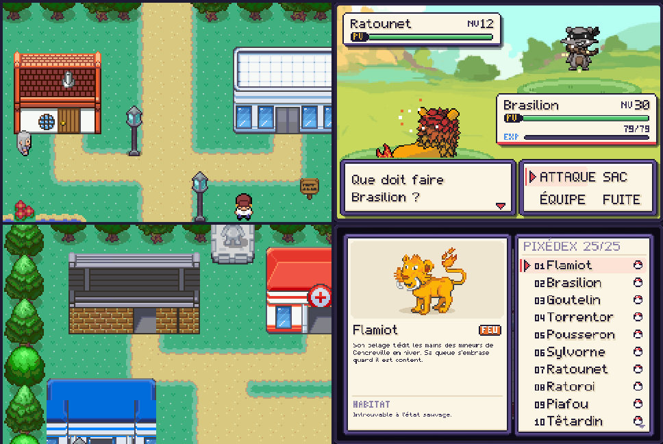

# Pixémon Éclipse

Un jeu de créatures en pixel art, en un seul fichier HTML : **ouvre `index.html` dans un navigateur** (ordinateur ou mobile).

**Commandes** : flèches/ZQSD pour bouger · Espace/Entrée = A · Échap = B (maintenir pour courir) · M = menu · souris et écran tactile acceptés.

## L'histoire

Aurélys vit au rythme du Cycle : le jour, Solarion veille ; la nuit, les créatures d'ombre s'éveillent… mais les nuits sont étrangement courtes.

- **Acte I** : Bourg-Lueur, la Route 1, Cendreville et le Badge Roc de Brasia, qui confie le Bracelet du Cycle. La Team Éclipse pille alors la Mine de Cendreville pour voler des Éclats d'Aube : il faut y sauver Tito, l'apprenti mineur, face au lieutenant Corvin. Puis la Forêt Murmure et le Mont Braise, où Vex, chef de la Team Éclipse, vole le Cœur d'Aube de Solarion et plonge la région dans une éclipse.
- **Acte II** : la Rive Brumeuse, Port-Miroir et sa championne Maëlle, la Grotte Écho, plongée dans le noir, et l'Observatoire. Là, on découvre qui est vraiment Vex, ce que les fondateurs d'Aurélys ont fait à Nocturion, le gardien de la nuit, et pourquoi il faut rétablir l'équilibre plutôt que de vaincre la nuit.
- **Après la fin** : un vrai cycle jour/nuit, Valen et Maëlle réunis sur le ponton, le Tournoi du Cycle de Brasia (quatre combats d'affilée et un Panthéon), des revanches d'arène, les Ruines de l'Aube et leur Sablier du Cycle, Solarion et Nocturion à défier, le journal de Valen, les Éclats d'Aube et le Pixédex à compléter.

## Ce qui fait le jeu

| Système | En bref |
|---|---|
| Éveil du Cycle | Le Bracelet de Brasia se charge à chaque coup donné ou reçu. Une fois par combat, ÉVEIL DU CYCLE éveille la créature : Solaire le jour (Attaque et Vitesse +1, soin), Lunaire la nuit (Attaque et Défense +1, statuts guéris). Vex, Maëlle, Kael et les gardiens s'éveillent aussi. |
| Lien | Chaque créature a un lien (5 cœurs) qui grandit en marchant en tête, en gagnant, en montant de niveau, au feu de camp ou avec des Biscuits d'Aube. Un lien fort lui fait tenir un coup fatal, chasser ses statuts, réussir plus de critiques et remplir plus vite la jauge d'Éveil. Maman enseigne RETOUR, dont la puissance dépend du lien (jusqu'à 102). |
| Objets tenus | Baies (Sève, Prisme), Miettes Dorées, Ruban Ténacité, Griffe Vive, Amulette Savante, Orbe Furie, Grelot Écho et un renforçateur par type. Arbres à baies qui repoussent chaque jour ; la Boutique rachète les objets. |
| Tableau des Missions | Dans les Centres de Soins : trois missions (capture, chasse par type, pêche) récompensées par de l'argent et des objets, remplacées dès qu'on touche la récompense. |
| Quêtes annexes | Une bulle « ! » dorée signale qui a quelque chose pour toi : montrer un Lumignon au Petit Théo, un Crapaflot au Vieux Gus, apporter trois Baies Prisme à Mémé Rosa, l'Ombrelin de Lili, et Maman qui enseigne RETOUR. |
| Guide | Dans le menu : la table des types (attaque / défense) et le rappel des mécaniques. Le compagnon très attaché déniche parfois des objets en chemin, et une mission « Éveil » apprend à utiliser le Bracelet. |
| IA des dresseurs | Les dresseurs envoient la créature la mieux placée face à la tienne ; les boss gardent leur atout pour la fin et rappellent une créature en mauvaise posture. |
| Cycle jour/nuit | Le temps avance à chaque pas. Les créatures, les PNJ, les soins et certains talents changent selon l'heure. Le lit de la maison (puis le Sablier) permet de choisir l'heure. |
| Événements | Averses (combats sous la pluie, créatures d'eau dans les herbes) et essaim du jour, annoncé dans le journal. |
| Affinités de terrain | Ronces → une créature PLANTE dans l'équipe ; rocher fissuré → ROCHE ; brasier → EAU. Elles ouvrent des raccourcis et des secrets. |
| Énigmes | Arène de Brasia : pousser des rochers dans les failles. Arène de Maëlle : deux vannes inversent la marée. Ruines : un casse-tête de rochers plus corsé. |
| Ciel de combat | Pluie, Zénith et Éclipse durent 5 tours et modifient les dégâts. Une attaque LUMIÈRE dissipe une éclipse. |
| Statuts et talents | Brûlure, poison, paralysie, sommeil ; chaque espèce a un talent passif annoncé en combat (Fermeté, Glissade, Sève Vive…). |
| PP et IA | Les capacités s'usent. Les dresseurs visent juste ; les boss posent des statuts, changent le ciel et utilisent des potions. |
| EXP partagée | Les participants gagnent toute l'EXP, le reste de l'équipe la moitié. |
| Compagnon | La créature de tête suit le joueur, réagit quand on lui parle et flaire les objets cachés. |
| Exploration | Pêche (canne de Gus), 12 Éclats d'Aube et l'Ermite Lumen, quête de Lili, 4 pages du journal de Valen, Pixédex récompensé, Repousse, créatures chromatiques. |

## Mise en scène

Cinématiques avec bandes noires, caméra et bulles d'émotion ; portraits animés dans les dialogues ; intro illustrée ; écran de badge ; générique de fin. En combat : vol stationnaire des créatures ailées, élan des attaques, effets propres à chaque type et à chaque capacité de soutien, zoom sur les critiques, barre d'EXP animée, transitions selon la situation. Dans le monde : lumières de nuit, brume, nuages, oiseaux, poissons, pluie. Musique chiptune par lieu (villes, routes, forêt, montagne, arènes, éclipse, ruines, combats, finale).

Le menu contient la carte de la région, le journal des quêtes (sur plusieurs pages) et les options (son, compagnon, vitesse du texte, combats rapides). L'écran titre présente les nouveautés de la version 6.0 et les crédits. Les sauvegardes des versions précédentes sont reprises automatiquement : les créatures reçoivent un lien selon leur niveau, et le Bracelet du Cycle est remis si le Badge Roc est déjà obtenu.

## Version 9.0 : Volterre, l'éclipse vivante et le défi d'Elias

- **4e arène dans l'histoire principale** : entre la Grotte Écho et l'Observatoire, la ville de **Volterre**, plongée dans le noir.
  - La Team Éclipse occupe la **Centrale** et détourne le courant vers la barrière du dôme.
  - Base sur deux niveaux : carte d'accès, code à 3 chiffres caché dans les documents, mémos de Vex, Caïus et Sélène, objets cachés, sbires aux stratégies différentes.
  - Boss : le Commandant Orso. Puis Kael découvre le dossier qui révèle que Vex est Valen, son frère.
  - **Arène Volt** : leviers qui inversent les barrières électriques. Le Champion Ambroise (paralysie puis vitesse) a construit le dôme avec Elias.
  - Récompenses : Badge Volt, Aimant, Bracelet du Cycle amélioré (jauge d'Éveil plus rapide). Le téléphérique mène ensuite à l'Observatoire.
  - Niveaux de l'Observatoire et du combat final remontés pour suivre ce 4e badge.
- **L'éclipse transforme le monde** :
  - 6 Larmes de Nocturion visibles seulement pendant l'éclipse, et la statue de Solarion qui pleure une larme de lumière.
  - La mer se retire sous le ponton de Port-Miroir et découvre une épave.
  - Rencontres d'ombre sur la Route 1, dans la Forêt et sur la Rive Brumeuse.
  - Particules et musique propres à l'éclipse.
  - Après Crépuscel, le Sablier peut rappeler une éclipse d'une journée. L'autel du Sanctuaire unit les larmes en **Amulette du Cycle**.
- **Pixédex** : fiche détaillée de chaque créature vue (statistiques, talent, chaîne d'évolution avec conditions, attaques, statut). Défilement rapide.
- **Monde vivant** :
  - Marchande itinérante (une ville par jour, stock tournant, cadeau de fidélité).
  - Facteur de Bourg-Lueur et lettres liées à la progression.
  - Carnet de voyage, orages à Volterre (Orageon sauvage), borne de recharge pour les créatures ÉLEC.
- **Liens** :
  - La Photographe Lise de Port-Miroir photographie tes créatures les plus proches, avec des récompenses et le Coeur du Cycle (liens plus rapides).
  - Message de confiance en combat important.
- **Combat** : indicateur d'efficacité directement dans la liste des attaques.
- **Défi ultime** : avec 60 espèces capturées et Crépuscel, Papa t'attend sous le dôme, la nuit. Équipe niveau 72 à 76. Récompense : l'Étoile d'Elias sur la Carte de Dresseur.
- **Audio** : thème de la Team Éclipse, musique des villes la nuit, thème du Sanctuaire. La musique suit le passage du jour à la nuit.

## Version 8.0 : la Faille et les nuits d'étoiles

- **La Faille** (après l'aventure) :
  - L'Admin Caïus refuse la paix et creuse sous le Sanctuaire.
  - Un donjon avec deux leviers à baisser (derrière un rocher fissuré et un brasier), un rocher à pousser dans un trou, et cinq dresseurs de la Team Éclipse aux stratégies différentes (sbire, foreurs, éclaireuse, sbire d'élite).
  - Boss : Caïus avec 5 créatures équipées d'objets tenus.
  - Récompense : la Capsule Cycle, une capture garantie.
- **7 nouveaux Pixémons** (70 au total) :
  - La lignée stellaire Nébulin → Galaxelle → Novarium.
  - Grumeroc et Conglolem, propres à la Faille.
  - Les jumeaux mythiques Héliote (le jour) et Séléniote (la nuit) au Sanctuaire.
- **Nuits d'étoiles filantes** (une nuit sur trois) :
  - Étoiles filantes dans le ciel.
  - Météosaur quatre fois plus fréquents.
  - Nébulin à pêcher avec la Super Canne.
  - Poussières d'étoile à ramasser, à échanger chez l'Astronome Lys contre des pierres et des objets rares.
- **Progression** :
  - L'objectif du journal guide aussi après la fin de l'histoire, étape par étape.
  - Revanche quotidienne contre Orane.
  - Récompenses du Pixédex jusqu'à 60 espèces, et une Capsule Cycle pour le Pixédex complet.
  - Rareté affichée dans le Pixédex.
- **Confort** :
  - 3 emplacements de sauvegarde, chacun avec sa copie de secours.
  - Volumes séparés pour la musique et les effets.
  - Correction : la pluie tombe maintenant aussi sur les Coteaux et à Lunévie, ce qui fait apparaître Nuageon.

## Version 7.0 : le Nord et le Crépuscule

- **Nouvelle région** :
  - Les Coteaux d'Aurore, au nord de Cendreville : vignes, cratères de météores, l'autel des fondateurs.
  - Lunévie, un village qui dort le jour et vit la nuit.
  - Le Sanctuaire du Cycle, ouvert après la fin.
- **22 nouveaux Pixémons** (63 au total), avec un vrai moteur d'évolution :
  - Évolutions selon le niveau, l'heure (jour ou nuit), le lien, l'éclipse ou une pierre (Pierre Lunaire, Pierre Orage).
  - Familles à 3 stades et évolutions à embranchement.
  - Un fossile à faire ranimer par le Prof. Saule.
  - Deux nouveaux légendaires : Crépuscel et Présagelle.
- **Histoire** :
  - L'Admin Caïus défie Sélène et Vex se montre à l'autel.
  - Sélène confie le Médaillon de Brume.
  - Chez Grand-mère Ysolde, on apprend que Valen est le grand frère de Kael. Kael livre un combat de rival, puis le médaillon revient à Valen.
- **Arène Crépuscule** : la Championne Orane ne combat que la nuit, dans une salle plongée dans le noir.
- **Après l'aventure** : le Défi du Crépuscule, 7 combats d'affilée avec paliers de récompenses et record.
- **Super Canne** : pêche en eaux profondes (Lunévie, Port-Miroir, Rive Brumeuse).
- **Boutique** : elle vend les pierres d'évolution après le 3e badge.
- **Pixédex encyclopédique** : taille, poids, activité (diurne ou nocturne), évolutions détaillées, habitat (pluie, éclipse, Super Canne).
- **Sauvegarde** :
  - Sauvegarde automatique toutes les 90 secondes en exploration.
  - Copie de secours en cas de fichier corrompu.
  - Migration des anciennes parties.

## Version 6.0 : une aventure complète

- **Introduction jouable** : un rêve étrange, puis le réveil le matin de tes 12 ans. Lou, ta petite sœur, a caché ta casquette ; il faut préparer ton sac, ta Carte de Dresseur, parler à Maman. Les objets de la maison (photos, carnet, télescope, manteau…) racontent l'histoire d'Elias, ton père astronome disparu, avec des gros plans illustrés.
- **41 Pixémons** (16 nouveaux) avec habitats, horaires et météo : certains ne sortent que la nuit, d'autres seulement sous l'orage ou sur certaines rives.
- **Écosystème vivant** : des Pixémons sauvages visibles qui dorment, mangent, jouent, observent le joueur, fuient ou chassent d'autres espèces. Les surprendre endormis facilite la capture.
- **Carnet d'observation** (Assistante Lucie), **quêtes** (Lou, Mémé Rosa, Lucie), **clairière secrète**, objets cachés plus visibles avec la Boussole d'Elias, télévision et dialogues qui changent avec l'histoire, et un fil narratif sur le père qui se conclut après la fin.

## Graphismes

Depuis la version 5.0, tout le jeu est dessiné avec de vrais graphismes en pixel art **libres**, issus du projet
[Tuxemon](https://github.com/Tuxemon/Tuxemon) : les 25 Pixémons (face, dos et icônes animées), les 32 personnages
(sprites de marche, de combat et portraits), les tuiles des cartes (herbe, chemins, rives, falaises, grottes, lave, intérieurs),
les bâtiments (maisons, labo, Centres de Soins, Boutiques, Arènes) et les fonds de combat (avec leur version de nuit).
Les cartes sont auto-tuilées par quarts de tuile (bords de chemins, rives, falaises). Licences et auteurs : voir [CREDITS.md](CREDITS.md).



## Développement

```
src/shell.html      page, style et pad tactile
src/game.js         code du jeu (données, cartes, histoire, combat, rendu)
src/world.js        rendu des cartes (tuiles, auto-tuilage, décors, animations)
src/sprites.json    créatures : face et dos 64x64, icônes 24x24 (PNG base64)
src/art.json        atlas des tuiles et décors, personnages, fonds de combat
tools/tuxatlas.py   régénère art.json et sprites.json depuis Tuxemon → python3 tools/tuxatlas.py [dossier Tuxemon]
tools/build.mjs     assemble index.html             → node tools/build.mjs
tools/sim.mjs       simule les combats de boss      → node tools/sim.mjs   (V3=1 : sans Éveil ni lien, BOND=0..5)
tools/play.mjs      parcours automatique (Playwright) → node tools/play.mjs tools/scn-story.js
tools/scn-v4.js     teste les mécaniques 4.0         → node tools/play.mjs tools/scn-v4.js
tools/scn-intro.js  teste l'introduction jouable     → node tools/play.mjs tools/scn-intro.js
tools/fontcheck.mjs vérifie que chaque caractère existe dans la police bitmap
```
